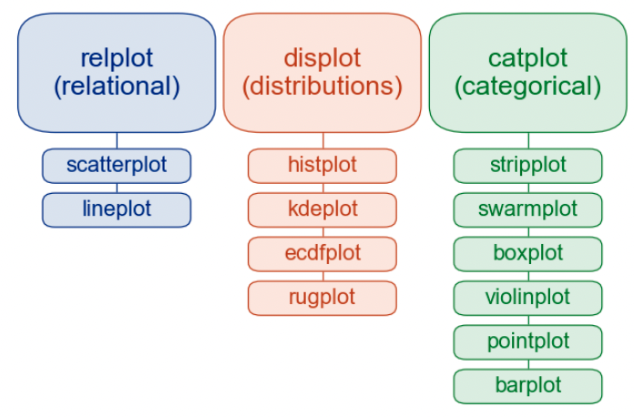

---
jupyter:
  jupytext:
    formats: ipynb,md
    text_representation:
      extension: .md
      format_name: markdown
      format_version: '1.3'
      jupytext_version: 1.11.3
  kernelspec:
    display_name: Python 3
    language: python
    name: python3
---

# 분석 내용

- 2013년부터 2019년까지의 전국 신규 민간 아파트의 분양 가격 동향을 분석한다.
- 다른 데이터셋을 가공하여 병합한다.
- 데이터 전처리 후에 시각화한다.
- 데이터셋은 공공데이터 포럼 (https://www.data.go.kr)
    - 전국 평균 분양가격(2013년 9월부터 2015년 8월까지)
    - 주택도시보증공사_전국 평균 분양가격(2019년 12월)
    
## 활용 functions 
- concat, pivot, transpose in Pandas
- groupby, pivot_table, info, describe, value_counts
- bar plot, line plot, scatter plot, lm plot, 히트맵, 상자수염그림, swarm plot, 도수분포표, 히스토그램

```python
import pandas as pd
import numpy as np


import warnings
warnings.filterwarnings("ignore")
```

# 데이터 분석 코드


## 데이터 불러오기

```python
# 인코딩을 하지 않을 경우, 파일 로드하며 한글이 깨진다.

df_last = pd.read_csv('data/주택도시보증공사_전국 평균 분양가격(2019년 12월).csv', encoding="cp949")

# 데이터 크기
df_last.shape
```

## 파일 미리보기

```python
df_last.head()
```

## 2015년 분양가 데이터 불러오기

```python
# 총 2개의 데이터 df_first, df_last가 불러왔다.

df_first = pd.read_csv('data/전국 평균 분양가격(2013년 9월부터 2015년 8월까지).csv', encoding="cp949")
df_first.shape
```

```python
df_first.head()
```

## 데이터 요약하기

```python
df_last.info()
```

## 결측치 보기

```python
df_last.isnull()
```

```python
df_last.isnull().sum()
```

## 데이터 타입 변경하기

보이는 형태는 숫자이지만 object 타입이므로 계산을 위해 수치 데이터 (int, float) 으로 변경한다.

```python
df_last["분양가격"] = pd.to_numeric(df_last["분양가격(㎡)"], errors="coerce")
df_last["분양가격"].head(1)
```

## column을 추가하여 새로운 값을 입력하기

df_last 데이터셋에 평당 분양 가격 column을 추가한다. 

```python
df_last["평당분양가격"] = df_last["분양가격"] * 3.3
df_last.head(1)
```

## 분양 가격 요약하기

```python
df_last.info()
```

```python
df_last['분양가격(㎡)'].describe()
```

## 전용면적 컬럼으로 변경하기

```python
df_last["규모구분"].unique()
```

```python
# 규모구분을 전용면적으로 변경하기

df_last["전용면적"] = df_last["규모구분"].str.replace("전용면적", "")
df_last["전용면적"] = df_last["전용면적"].str.replace("초과", "~")
df_last["전용면적"] = df_last["전용면적"].str.replace("이하", "")
df_last["전용면적"] = df_last["전용면적"].str.replace(" ", "").str.strip()
df_last["전용면적"]
```

## 불필요한 컬럼 제거하기

```python
df_last = df_last.drop(["규모구분", "분양가격(㎡)"], axis=1)
```

```python
df_last
```

## groupby로 데이터 재가공하기

```python
# 지역명에 따른 평당 분양 가격 평균가를 구한다.
# sum, mean, max, min, describe 등을 구할 수 있다.

df_last.groupby(["지역명"])["평당분양가격"].mean()
```

```python
# 전용면적으로 분양가격의 평균을 구합니다.

df_last.groupby(["전용면적"])["평당분양가격"].mean()
```

```python
# 지역명, 전용면적으로 평당분양가격의 평균을 구합니다.
# unstack() 하면 groupby 하고자 하는 내용이 컬럼으로 나온다.
# round() 하면 소숫점 1자리까지만 보여준다.

df_last.groupby(["전용면적", "지역명"])["평당분양가격"].mean().unstack().round()
```

```python
# 연도, 지역명으로 평당분양가격의 평균을 구합니다.

g = df_last.groupby(["연도", "지역명"])["평당분양가격"].mean()
g
# g.unstack().transpose()
```

## pivot table로 데이터 집계

groupby 대신 pivot_table로 데이터 집계 가능하다.
- groupby를 사용하면 series 형태로 결과가 나온다.
- pivot_table 결과는 data frame 형태로 결과가 나온다.

```python
pd.pivot_table(df_last, index=["지역명"], values=["평당분양가격"], aggfunc="mean")
```

```python
# df_last.groupby(["전용면적"])["평당분양가격"].mean()
# pivot과 pivot_table의 가장 큰 차이점은 aggregation 기능이 있느냐 없느냐 차이.
# pivot_table의 aggregation default 값은 mean.

pd.pivot_table(df_last, index="전용면적", values="평당분양가격")
```

```python
# 지역명, 전용면적으로 평당분양가격의 평균을 구합니다.
# df_last.groupby(["전용면적", "지역명"])["평당분양가격"].mean().unstack().round()
# groupby는 series이므로 연산 속도가 더 빠르다.

df_last.pivot_table(index="전용면적", columns="지역명", values="평당분양가격").round()
```

```python
# 연도, 지역명으로 평당분양가격의 평균을 구합니다.
# g = df_last.groupby(["연도", "지역명"])["평당분양가격"].mean()

p = pd.pivot_table(df_last, index=["연도", "지역명"], values="평당분양가격")
# 행을 기준으로 가져올 때 loc를 쓴다. 2017년 데이터만 갖고 오고 싶으면 다음과 같다. 
p.loc[2017]
```

# 한글 폰트 사용하기

```python
import matplotlib.pyplot as plt

plt.rc("font", family="AppleGothic")
```

# 데이터 시각화 하기


## 선 그래프와 막대 그래프

```python
# 지역명으로 분양 가격의 평균을 구하고 선 그래프로 시각화 한다.

g = df_last.groupby(["지역명"])["평당분양가격"].mean().sort_values(ascending=False)
g.plot()
```

```python
# 지역명으로 분양 가격의 평균을 구하고 막대 그래프로 시각화 한다.

g.plot.bar(rot=0, figsize=(10, 3))
```

```python
# 전용면적으로 분양가격의 평균을 구하고 막대그래프로 시각화 한다.

df_last.groupby(["전용면적"])["평당분양가격"].mean().plot.bar()
```

```python
# 연도별 분양가격의 평균을 구하고 막대그래프(bar)로 시각화 합니다.

df_last.groupby(["연도"])["평당분양가격"].mean().plot.bar()
```

## box-and-whisker plot

5가지 요약 수치를 그린다.

- 최솟값
- 제 1사분위수
- 제 2사분위수( ), 즉 중앙값
- 제 3 사분위 수( )
- 최댓값

```python
df_last.pivot_table(index="월", columns="연도", values="평당분양가격").plot.box()
```

```python
p = df_last.pivot_table(index="월", columns=["연도", "전용면적"], values="평당분양가격")
p.plot.box(figsize=(15, 3), rot=30)
```

```python
p = df_last.pivot_table(index="연도", columns="지역명", values="평당분양가격")
p.plot(figsize=(15, 3), rot=30)
```

# Seaborn으로 시각화하기

```python
# seaborn을 import 하기

import seaborn as sns
```

```python
# barplot으로 지역별 평당분양가격을 그려봅니다.

plt.figure(figsize=(10, 3))

# 막대 위에 검은 색은 ci(confidence interval) 값을 뜻한다.
# ci의 기본값은 95%이며 cd="sd"는 표준편차 값을 보여준다.
# ci는 추정치를 사용하므로 계산이 오래 걸릴 수 있다. 

sns.barplot(data=df_last, x="지역명", y="평당분양가격", ci="sd")
```

```python
# barplot으로 연도별 평당분양가격을 그린다.

sns.barplot(data=df_last, x="연도", y="평당분양가격")
```

## Put legend out of the figure

https://stackoverflow.com/questions/30490740/move-legend-outside-figure-in-seaborn-tsplot

```python
# lineplot으로 연도별 평당분양가격을 그린다.
# hue 옵션을 통해 지역별로 다르게 표시한다.

plt.figure(figsize=(10, 5))
sns.lineplot(data=df_last, x="연도", y="평당분양가격", hue="지역명")
plt.legend(bbox_to_anchor=(1.02, 1), loc=2, borderaxespad=0.)
```

```python
sns.relplot(data=df_last, x="연도", y="평당분양가격", hue="지역명", kind="line", col="지역명", col_wrap=4, ci=None)
```

## catplot

```python
sns.catplot(data=df_last, x="연도", y="평당분양가격", kind="bar", col="지역명", col_wrap=4)
```

```python
# 쥬피터 노트북에 이미지 삽입 위한 코드

!pip install IPython
```

```python
# 쥬피터 노트북에 이미지 삽입 위해 Ipython 불러오기

from IPython.display import Image
```

## relplot과 catplot의 차이점

catplot과 relplot이 서브플롯을 생성할 때, FacetGrid를 그려주는 역할을 한다.
catplot은 범주형 변수에 대한 서브플롯을 그리고, relplot은 수치형 변수에 대한 서브플롯을 그려준다.




## boxplot과 violinplot

```python
# 연도별 평당분양가격을 boxplot으로 그려봅니다.

sns.boxplot(data=df_last, x="연도", y="평당분양가격")
```

```python
# hue옵션을 주어 전용면적별로 다르게 표시해 봅니다.

plt.figure(figsize=(15, 5))
sns.boxplot(data=df_last, x="연도", y="평당분양가격", hue="전용면적")
```

```python
# 연도별 평당분양가격을 violinplot으로 그려봅니다.
# violinplot은 밀도 추정 그래프를 세로로 세워놓은 모양이다. 

sns.violinplot(data=df_last, x="연도", y="평당분양가격")
```

## lmplot과 swarmplot

```python
# 연도별 평당분양가격을 lmplot으로 그린다. 
# hue 옵션으로 전용면적을 표현한다.
# regplot에서 hue를 사용하고 싶을 때, lmplot
# lmplot은 x, y축 모두 수치 데이터일 때 적합하다.

sns.lmplot(data=df_last, x="연도", y="평당분양가격", hue="전용면적", col="전용면적", col_wrap=3)
```

```python
# 연도별 평당분양가격을 swarmplot 으로 그려봅니다. 
# swarmplot은 범주형(카테고리) 데이터의 산점도를 표현하기에 적합합니다.
# 다소 오래 걸린다.

plt.figure(figsize=(15, 5))
sns.swarmplot(data=df_last, x="연도", y="평당분양가격", hue="전용면적")
```

## 이상치 보기

```python
# 평당분양가격의 최대값을 구해서 max_price 라는 변수에 담습니다.

df_last["평당분양가격"].describe()
```

```python
max_price = df_last["평당분양가격"].max()
max_price
```

```python
# 서울의 평당분양가격이 특히 높은 데이터가 있다. 

df_last[df_last["평당분양가격"] == max_price]
```

## 히스토그램 그리기

```python
# 10개의 bin에 해당되는 데이터를 담는다.
h = df_last["평당분양가격"].hist(bins=10)
```

```python
# 결측치가 없는 데이터에서 평당분양가격만 가져온다. 
# .loc[행, 열]

price = df_last.loc[df_last["평당분양가격"].notnull(), "평당분양가격"]
```

```python
# distplot으로 평당분양가격을 표현.

sns.distplot(price)
```

```python
# sns.distplot(price, hist=False, rug=True)
# cumulative=True : 누적 그래프
# kde : 커널 밀도를 추정한 값.

sns.kdeplot(price)
```

```python
# subplot으로 표현

g = sns.FacetGrid(df_last, row="지역명", height=1.7, aspect=4)
g.map(sns.distplot, "평당분양가격", hist=False, rug=True)
```

```python
# pairplot

df_last_notnull = df_last.loc[df_last["평당분양가격"].notnull(), 
                          ["연도", "월", "평당분양가격", "지역명", "전용면적"]]
sns.pairplot(df_last_notnull, hue="지역명")
```

```python
# 규모구분(전용면적)별로 value_counts를 사용해서 데이터를 집계해 봅니다.

df_last["전용면적"].value_counts()
```

# 2015년 8월 이전 데이터 다루기

```python
pd.options.display.max_columns = 25
```

```python
df_last.head()
```

```python
df_first.head()
```

```python
df_first.info()
```

```python
# 결측치 확인

df_first.isnull().sum()
```

## melt를 이용하여 reshaping

[Reshaping by melting](https://pandas.pydata.org/docs/user_guide/reshaping.html#reshaping-by-melt)

```python
df_first.head(1)
```

```python
df_first.melt(id_vars="지역", var_name="기간", value_name="평당분양가격")
```

```python
# pd.melt 를 사용하며, 녹인 데이터는 df_first_melt 변수에 담는다. 

df_first_melt = df_first.melt(id_vars="지역", var_name="기간", value_name="평당분양가격")
df_first_melt.head()
```

```python
# df_first_melt 변수에 담겨진 컬럼의 이름을 
# ["지역명", "기간", "평당분양가격"] 으로 변경합니다.

df_first_melt.columns = ["지역명", "기간", "평당분양가격"]
df_first_melt.head(1)
```

## 연도와 월을 분리하기

```python
date = "2013년12월"
date
```

```python
date.split("년")
```

```python
date.split("년")[0]
```

```python
date.split("년")[1]
```

```python
date.split("년")[-1].replace('월', "")
```

```python
# parse_year라는 함수를 만든다.
# 연도만 반환하도록 하며, 반환하는 데이터는 int 타입이 되도록 한다.

def parse_year(date):
    year = date.split("년")[0]
    return int(year)

y = parse_year(date)
print(type(y))
y
```

```python
# parse_month 라는 함수를 만듭니다.
# 월만 반환하도록 하며, 반환하는 데이터는 int 타입이 되도록 합니다.

def parse_month(date):
    month = date.split("년")[-1].replace('월', "")
    return int(month)

parse_month(date)
```

```python
# df_first_melt 변수에 담긴 데이터프레임에서 
# apply를 활용해 연도만 추출해서 새로운 컬럼에 담는다.

df_first_melt["연도"] = df_first_melt["기간"].apply(parse_year)
df_first_melt.head(1)
```

```python
df_first_melt["월"] = df_first_melt["기간"].apply(parse_month)
df_first_melt.head(1)
```

```python
df_last.sample()
```

```python
df_first_melt.sample()
```

```python
df_last.columns.to_list()
```

```python
cols = ['지역명', '연도', '월', '평당분양가격']
cols
```

```python
df_last_prepare = df_last.loc[df_last["전용면적"] == "전체", cols].copy()
df_last_prepare.head(1)
```

```python
# df_first_melt에서 공통된 컬럼만 가져온 뒤
# copy로 복사해서 df_first_prepare 변수에 담는다.

df_first_prepare = df_first_melt[cols].copy()
df_first_prepare.head(1)
```

# 두 개의 데이터 프레임 다루기

## concat으로 두 개의 데이터프레임 합치기

```python
# df_first_prepare 와 df_last_prepare 를 합친다.

df = pd.concat([df_first_prepare, df_last_prepare])
df.shape
```

```python
df.head()
```

```python
# 연도별로 데이터가 몇개씩 있는지 value_counts를 통해 세어 본다.

df["연도"].value_counts(sort=False)
```

## pivot_table 사용하기

```python
# 연도를 인덱스로, 지역명을 컬럼으로 평당분양가격을 피봇테이블로 그리기.
# pivot은 연산 없이 데이터 형태만 바꾸는 것
# pivot_table은 연산 가능

t = pd.pivot_table(df, index="연도", columns="지역명", values="평당분양가격").round()
t
```

```python
# 위에서 그린 피봇테이블을 히트맵으로 표현하기.

plt.figure(figsize=(15, 7))
sns.heatmap(t, cmap="Blues", annot=True, fmt='.0f')
```

```python
# transpose 를 사용하면 행과 열을 바꾼다.

# t.transpose() 또한 같은 기능
t.T
```

```python
plt.figure(figsize=(15, 7))
sns.heatmap(t.T, cmap="Blues", annot=True, fmt='.0f')
```

```python
# Groupby를 사용하기. 인덱스에 ["연도", "지역명"] 을 넣는다.

g = df.groupby(["연도", "지역명"])["평당분양가격"].mean().unstack().round()
g
```

```python
plt.figure(figsize=(15, 7))
sns.heatmap(g.T, annot=True, fmt=".0f", cmap="Greens")
```

## 연도별 평당분양가격 시각화

```python
# barplot 으로 연도별 평당분양가격 그리기

sns.barplot(data=df, x="연도", y="평당분양가격")
```

```python
# pointplot 으로 연도별 평당분양가격 그리기

plt.figure(figsize=(15, 4))
sns.pointplot(data=df, x="연도", y="평당분양가격", hue="지역명")
# 레전드를 밖에 위치 시키기
plt.legend(bbox_to_anchor=(1.02, 1), loc=2, borderaxespad=0.)
```

```python
# 서울만 barplot 으로 그리기

df_seoul = df[df["지역명"] == "서울"].copy()
sns.barplot(data=df_seoul, x="연도", y="평당분양가격")
sns.pointplot(data=df_seoul, x="연도", y="평당분양가격")
```

```python
# 연도별 평당분양가격 boxplot 그리기

sns.boxplot(data=df, x="연도", y="평당분양가격")
```

```python
# boxenplot = boxplot + violinplot 과 비슷하다.

sns.boxenplot(data=df, x="연도", y="평당분양가격")
```

```python
# 연도별 평당분양가격 violinplot 그리기
plt.figure(figsize=(10, 5))
sns.violinplot(data=df, x="연도", y="평당분양가격")
```

```python
# 연도별 평당분양가격 swarmplot 그리기

plt.figure(figsize=(12, 5))
sns.swarmplot(data=df, x="연도", y="평당분양가격", hue="지역명")
# 레전드를 밖에 위치 시키기
plt.legend(bbox_to_anchor=(1.02, 1), loc=2, borderaxespad=0.)
```

```python
plt.figure(figsize=(12, 5))
sns.violinplot(data=df, x="연도", y="평당분양가격")
sns.swarmplot(data=df, x="연도", y="평당분양가격", hue="지역명")
# 레전드를 밖에 위치 시키기
plt.legend(bbox_to_anchor=(1.02, 1), loc=2, borderaxespad=0.)
```

## 지역별 평당분양가격 보기

```python
# barplot 으로 지역별 평당분양가격을 그려봅니다.

plt.figure(figsize=(12, 4))
sns.barplot(data=df, x="지역명", y="평당분양가격")
```

```python
# boxplot 으로 지역별 평당분양가격을 그려봅니다.

plt.figure(figsize=(12, 4))
sns.boxplot(data=df, x="지역명", y="평당분양가격")
```

```python
# boxenplot 으로 지역별 평당분양가격을 그려봅니다.

plt.figure(figsize=(12, 4))
sns.boxenplot(data=df, x="지역명", y="평당분양가격")
```

```python
# violinplot 으로 지역별 평당분양가격을 그려봅니다.

plt.figure(figsize=(20, 5))
sns.violinplot(data=df, x="지역명", y="평당분양가격")
```

```python
# swarmplot 으로 지역별 평당분양가격을 그려봅니다.

plt.figure(figsize=(12, 4))
sns.swarmplot(data=df, x="지역명", y="평당분양가격")
```
